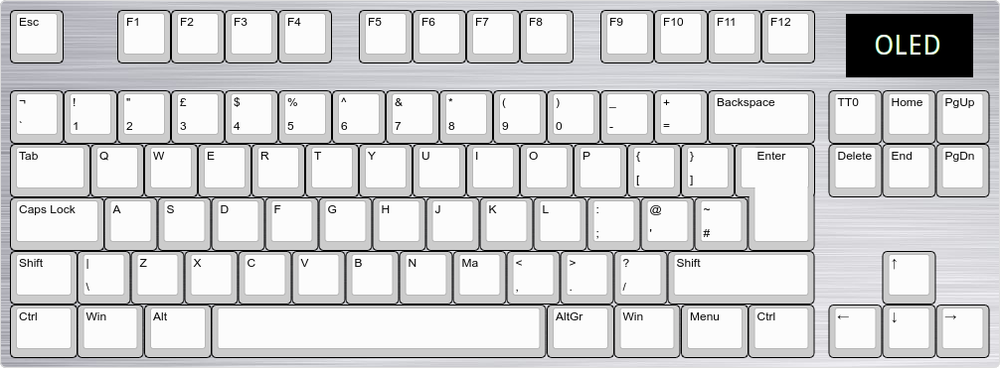
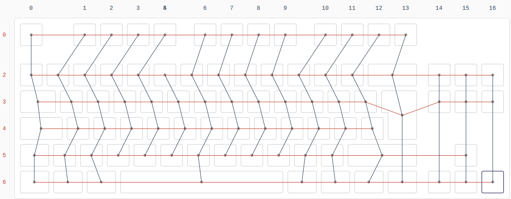

# keyboard

The keyboard is made using a STM32F411CEU6, which is plenty fast and has 512KiB of flash, allowing you to use all the QMK features that you want (up to 3 USB endpoints).

The layout is an ISO TKL without 3 keys (see image)

I didn't use the MCU as is, i used [this board](https://stm32-base.org/boards/STM32F411CEU6-WeAct-Black-Pill-V2.0.html)

[See pinout](https://images-ext-1.discordapp.net/external/m9eAxXDaRQtiADBTBpzNd6Dkb2kGMh4hCkD6UWoW-hQ/https/i.imgur.com/nCgeolT.png).

I also used an SSD1306 OLED 128x64 display for stuff like caps lock, current layer, WPM and probably a clock too.

For the LEDs i used two IS31FL3737 ICs, which can control up to 48 RGB LEDs each, and since this keyboard has 85 keys, i needed two, leaving some spare. (2x48=96)

Everything is i2c meaning we only have to use two pins for both the LED controllers and the OLED. (SDA1 and SCL1)

Then it came making the PCB from scratch. I started by designing the matrix, and after some tinkering i got to a layout that i liked.

That's 7 rows and 17 columns, just enough remaining (as some pins are reserved for the USB port and some more stuff).

With the matrix design done it was time to design the actual PCB.
